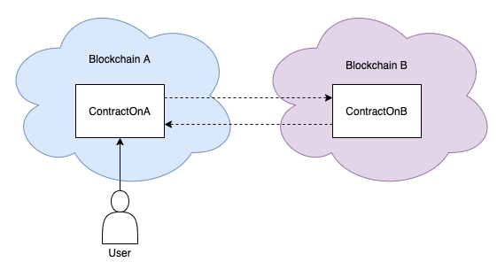
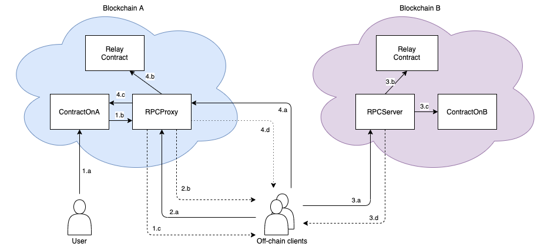

# Asynchronous Cross-Blockchain Smart Contract Calls

> _Important: This project is a research prototype. 
  It represents ongoing work conducted within the [TAST](https://dsg.tuwien.ac.at/projects/tast/) 
  research project. Use with care._

This project contains Ethereum smart contracts that enable asynchronous smart contract calls across Ethereum-based blockchains. 

This means that a smart contract on blockchain A is able to call a smart contract on blockchain B in a fully 
decentralized manner without having to worry about the underlying cross-blockchain communication.




The ability to verify transactions "across" different blockchains is vital to enable applications such as 
[cross-blockchain token transfers](https://dsg.tuwien.ac.at/projects/tast/pub/tast-white-paper-5.pdf).

Imagine you have the following two contracts as in the picture above.

```solidity
contract ContractOnA {
    ...

    function callRemoteFunction(address _param1, uint _param2) public {
        bytes memory callData = abi.encodeWithSignature("remoteFunction(address,uint256)", _param1, _param2);
        blockchainB.callContract(contractOnB, callIdentifier, callData, "callback");
    }

    function callback(uint _dappSpecificId, bytes memory _result, bool _success) public {
        ...
    }
}
```

```solidity
contract ContractOnB {
    ...

    function remoteFunction(address _param1, uint _param2) public returns (uint) {
        ...
    }
}
```

`ContractOnA` is a smart contract deployed on blockchain A and `ContractOnB` is a smart contract deployed on blockchain B.

When a user calls function `callRemoteFunction()` of `ContractOnA` it causes a call of function `remoteFunction()` of `ContractOnB`.
Once the the remote function call has been executed, the execution result of `remoteFunction()` will be returned to 
`ContractOnA` by means of a custom callback function.

## How it works

The project is based on traditional [remote procedure calls (RPC)](https://en.wikipedia.org/wiki/Remote_procedure_call). 
Accordingly, the project consists of two main contracts:

* `RPCProxy`
* `RPCServer`

Additionally, the following components are required which are not part of this repo.

* `RelayContract` (e.g., [EthRelay](https://github.com/pantos-io/testimonium))
* Off-chain clients

Similar to RPCs, contracts can call a proxy contract (represented by `RPCProxy`)
which sends a call request to a specialized contract on the remote blockchain (`RPCServer`).  
`RPCServer` then calls the requested function of the requested contract on the remote blockchain.
After execution, the response is sent back to `RPCPRoxy` which forwards it to the calling contract.

As blockchains cannot natively communicate with each other, the actual cross-blockchain communication
is handled by a set of off-chain clients that pass transactions from one chain to the other.

When blockchain B (blockchain A) receives a transaction by an off-chain client from blockchain A (blockchain B),
blockchain B (blockchain A) needs to be certain that the transaction has actually been included in blockchain A (blockchain B).
For that, `RPCProxy` and `RPCServer` leverage blockchain relays, such as [EthRelay](https://github.com/pantos-io/testimonium).

Let us consider the example from above again. 
The following picture shows what happens under the hood when a remote call is made.



### 1. Remote call preparation
#### a. User calls application contract on chain A
User calls function `callRemoteFunction()` of `ContractOnA` on blockchain A.
Function `callRemoteFunction()` contains a cross-blockchain call, i.e., it wants to call function `remoteFunction` 
of `ContractOnB` on blockchain B.

#### b. Application contract makes a cross-chain call using the RPCProxy (“callContract()”)
`ContractOnA` prepares the cross-blockchain call by calling the `RPCProxy`.

```solidity
RPCProxy blockchainB;
bytes memory callData = abi.encodeWithSignature("remoteFunction(address,uint256)", _param1, _param2);
blockchainB.callContract(contractOnB, callIdentifier, callData, "callback");
```

#### c. Off-chain client is informed about the cross-chain call
When `ContractOnA` makes a cross-chain call using the `RPCProxy`, 
the `RPCProxy` emits a "CallPrepared" event which is caught by a set of off-chain clients.

### 2. Cross-chain call request
> This step is only necessary as Ethereum transactions do not encode the complete call chain of a transactions. Only the address of the first called contract is contained in the transaction.

We need to make sure that cross-chain calls are only successful if 
they are made using the correct `RPCProxy` contract.
 
In Ethereum transactions, we only have access to the first address of the call chain, 
we do not know which "internal" contract calls have taken place.
 
The "to" field of a transaction only contains `ContractOnA`'s address and not the `RPCProxy`’s address.
We have no way of knowing whether `ContractOnA` subsequently called the right `RPCProxy` 
or just a fake one. Two further steps are thus necessary.

#### a. Off-chain client creates cross-chain call request (“requestCall()”)
After the off-chain client is informed about a pending cross-chain call via the "CallPrepared" event on chain A, 
it can create a cross-chain call request via function `RPCProxy.requestCall()`. 
This is done by sending a transaction directly to the `RPCProxy`.

This time, `RPCProxy` is called directly, its address is therefore encoded in the "to" field of the transaction. 
Thus, once the transaction is forwarded to blockchain B, 
blockchain B can verify that it was the correct `RPCProxy` which requested the call and not a fake proxy.

#### b. Off-chain client receives “CallRequested” event
When the `RPCProxy` executes the `requestCall()` transaction, it emits a "CallRequested" event.
This indicates that the call can now be relayed for execution to blockchain B. 

### 3. Cross-chain call execution
#### a. Off-chain client relays call request to blockchain B (“executeCall()”)
Once the off-chain client receives the "CallRequested" event, 
it can relay the call to blockchain B.
That means, the transaction data that called `requestCall()` is encoded in a transaction itself and
relayed to blockchain B.
This is done by calling function `executeCall()` of contract `RPCServer` on blockchain B.

When `RPCServer` receives the transaction the following 2 steps are executed.

#### b. Verify that the passed requestCall transaction is included in blockchain A
Before the call can be executed on `ContractOnB`, 
it needs to be checked that the `requestCall()` transaction was actually included and executed successfully on blockchain A.
Further, it needs to be checked that the `requestCall()` transaction was submitted to the correct 
`RPCProxy` contract on blockchain A.

#### c. Execute “cross-chain” call on application contract
After the RPCServer is sure that the call request actually exists on blockchain A,
it can now forward the actual call to `ContractOnB` as indicated by the call request.
After the remote call has been executed by `ContractOnB`, `RPCServer` emits a "CallExecuted" event
encoding the result value from the remote call.

#### d. Off-chain client receives "CallExecuted" event from RPCServer
When the off-chain client receives the "CallExecuted" event,
it knows that the application contract call was executed.

### 4. Cross-chain call acknowledgement
#### a. Off-chain client sends `acknowledgeCall()` transaction to `RPCProxy` on blockchain A
The `acknowledgeCall()` transaction contains the transaction data of the `executeCall()` transaction
that was executed on blockchain B.
Before the call acknowledgement can be returned to `ContractOnA`,
it needs to be checked that `executeCall()` has indeed been included and executed by `RPCServer` on blockchain B.

#### b. Verify that the passed `executeCall()` transaction is included in blockchain B
Before the acknowledgement can be executed on `ContractOnA`, 
it needs to checked that the `executeCall()` transaction was actually included and executed 
successfully on blockchain B. 
Further, it needs to be checked that the `executeCall()` transaction was submitted to the correct `RPCServer` 
contract on blockchain B.

#### c. Acknowledge cross-chain call on blockchain A
After the `RPCProxy` is sure that the `executeCall()` transaction actually exists on blockchain B, 
it can now execute the acknowledgement. 
For that, it looks up the stored callback function for the call and calls this function of `ContractOnA`.
After the callback has been executed by `ContractOnA`, 
the `RPCProxy` contract emits a "CallAcknowledged" event.

#### d. Off-chain client receives "CallAcknowledged" event
When the off-chain clients receive the "CallAcknowledged" event, 
they know that the remote contract call has been completed.

###
A more detailed explanation can be found [here](https://dsg.tuwien.ac.at/projects/tast/pub/TODO).


## Installation
This repository contains the `RPCProxy` and `RPCServer` contracts.
To deploy these contracts on a local blockchain you need to have the following tools installed:

* [Node](https://nodejs.org/en/)
* [Truffle](https://www.trufflesuite.com/truffle)
* [Ganache](https://www.trufflesuite.com/ganache)

Then execute the following steps:
1. Clone the repository: `git clone git@github.com:pantos-io/x-chain-smartcontracts.git`
2. Change into the project directory: `cd x-chain-smartcontracts/`
3. Install all dependencies: `npm install`
4. Start Ganache (make sure it listens to port 7545)
5. Deploy contracts: `truffle migrate --reset`
6. Run the tests with `truffle test` 

## How to contribute
Testimonium is a research prototype. We welcome anyone to contribute.
File a bug report or submit feature requests through the [issue tracker](https://github.com/pantos-io/TODO/issues). 
Feel free to submit a pull request.

## Acknowledgements
* The development of this prototype was funded by [Pantos](https://pantos.io/) within the [TAST](https://dsg.tuwien.ac.at/projects/tast/) research project.
* The code for the RLPReader contract comes from [Hamdi Allam](https://github.com/hamdiallam/Solidity-RLP).

## Licence
This project is licensed under the [MIT License](LICENSE).
